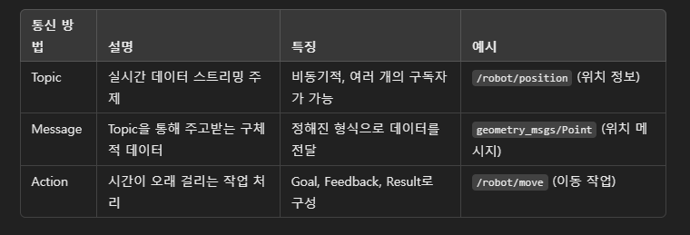

# ROS 배우기

---

## **챕터 1. ROS의 기본 구조**

### **1. ROS가 무엇인가요?**  
- **ROS**는 로봇의 **뇌**와 같은 역할을 합니다.  
- 로봇이 **"나는 지금 어디 있지?"**, **"무엇을 해야 하지?"** 이런 질문을 스스로 하며 대답할 수 있게 해주는 시스템입니다.  
- ROS는 로봇들이 서로 **대화**할 수 있게 만들어주는 **언어**라고 생각하시면 됩니다.

---

### **2. ROS의 기본 구조는 어떻게 생겼나요?**  
ROS는 세 가지 중요한 역할을 합니다:
1. **노드(Node):**  
   - **노드**는 로봇의 작은 뇌와 같습니다.  
   - 예를 들어:  
     - "눈"은 **카메라 노드**,  
     - "귀"는 **마이크 노드**,  
     - "입"은 **말하는 노드**와 같아요!

2. **토픽(Topic):**  
   - 노드들이 **정보를 주고받는 편지봉투**입니다.  
   - 예를 들어, "카메라 노드"가 찍은 사진을 "토픽"에 담아 다른 노드에게 보낼 수 있어요.

3. **메시지(Message):**  
   - 메시지는 **편지 내용**입니다.  
   - 예를 들어, 메시지에는 로봇의 위치, 속도, 또는 카메라 사진 등의 정보가 포함됩니다.

---

## **챕터 2. ROS 통신 방법**

### **1. ROS 통신의 3가지 방법**
ROS에서는 노드들이 대화하는 방법이 3가지가 있습니다:
1. **Publisher와 Subscriber (발행-구독):**  
   - "Publisher"는 **정보를 보내는 사람**입니다.  
   - "Subscriber"는 **정보를 받는 사람**입니다.  
   - 예를 들어:  
     - "카메라 노드"가 사진을 **발행(Publish)** 하면,  
     - "AI 노드"가 그 사진을 **구독(Subscribe)** 해서 받아요.

2. **Service와 Client (서비스-클라이언트):**  
   - "Service"는 **질문에 대답하는 사람**,  
   - "Client"는 **질문하는 사람**입니다.  
   - 예를 들어:  
     - 로봇이 "지금 내 위치가 어디인가요?"라고 물어보면,  
     - "Service"가 "너는 x=10, y=20에 있어요!"라고 대답해요.

3. **Action (액션):**  
   - 액션은 **시간이 오래 걸리는 일**을 처리할 때 사용합니다.  
   - 예를 들어:  
     - 로봇에게 "5분 동안 방 청소를 해주세요!"라고 명령하면,  
     - 로봇은 "알겠습니다. 지금 몇 퍼센트 진행되었어요!"라고 중간중간 알려줍니다.

---

## **챕터 3. 패키지와 워크스페이스**

### **1. 패키지(Package)가 무엇인가요?**
- **패키지**는 로봇의 **공구 상자**입니다.  
- 여기에는 노드, 코드, 설정 파일 등 로봇이 필요로 하는 모든 것들이 들어 있습니다.

### **2. 워크스페이스(Workspace)는 무엇인가요?**
- **워크스페이스**는 로봇이 작업을 하는 **작업실**입니다.  
- 우리가 코드를 작성하고 수정하고 실행하는 장소입니다.

---

## **챕터 4. Gazebo 연동**

### **1. Gazebo는 무엇인가요?**
- **Gazebo**는 로봇을 위한 **가상 놀이터**입니다.  
- 실제 로봇을 망가뜨리지 않고도, 로봇을 연습시키고 테스트할 수 있는 환경입니다.

### **2. Gazebo와 ROS는 어떻게 연결되나요?**
- ROS와 Gazebo를 연결하면,  
  로봇이 **가상 놀이터**에서 움직이면서 **ROS 뇌**가 역할을 하게 됩니다.

dd

# ROS 통신 방법: Topic, Message, Action

ROS (Robot Operating System)는 로봇을 제어하고 다양한 작업을 할 수 있도록 돕는 운영 체제입니다. 이 시스템에서 로봇은 서로 통신해야 하기 때문에 **Topic**, **Message**, **Action**이라는 세 가지 방법을 사용합니다. 각 통신 방법을 이해하면, 로봇이 어떻게 다른 로봇이나 컴퓨터와 정보를 주고받는지 알 수 있습니다.

---

## 1. Topic (토픽)

### Topic이란 무엇인가요?
- **Topic**은 로봇들이 서로 정보를 주고받는 **주제**를 의미합니다. 로봇들이 정보를 주고받을 때, 그 정보는 특정 **주제**에 해당하는 데이터가 됩니다.
- 예를 들어, 로봇이 다른 로봇이나 센서에서 위치 정보를 얻을 때, 그 정보는 "위치"라는 **Topic**을 통해 주고받습니다.

### Topic의 특징:
- **발행자(Publisher)**와 **구독자(Subscriber)**가 있습니다.
  - 발행자: 정보를 보내는 주체
  - 구독자: 정보를 받는 주체
- **한 번에 여러 개의 구독자**가 있을 수 있습니다. 하나의 Topic에 대해 여러 로봇이나 컴퓨터가 정보를 받아서 사용할 수 있습니다.
- **비동기적**: Topic은 실시간으로 정보를 계속 보내고 받을 수 있습니다. 예를 들어, 로봇이 움직일 때마다 위치 정보를 계속 보내는 것처럼요.

### 예시:
- **Topic**: "/robot/position"
  - 발행자: 로봇 (위치 정보를 보내는 주체)
  - 구독자: 다른 로봇이나 컴퓨터 (위치 정보를 받는 주체)

---

## 2. Message (메시지)

### Message란 무엇인가요?
- **Message**는 정보를 담고 있는 **데이터**입니다. Topic은 주제만 정하고, 그 안에서 주고받는 실제 데이터가 **Message**입니다.
- Message는 특정 포맷(형식)을 가지고 있어서, 다른 시스템이 쉽게 이해할 수 있도록 전달됩니다.

### Message의 특징:
- Message는 **정해진 형식**을 가지고 있습니다. 예를 들어, 로봇의 위치를 나타내는 메시지는 `(x, y, z)` 좌표값을 포함할 수 있습니다.
- 이 메시지는 간단한 숫자에서부터 복잡한 데이터까지 다양한 종류가 있을 수 있습니다.
- Message는 한 번에 하나의 데이터를 전달하므로, 실시간으로 정보를 주고받을 때 사용됩니다.

### 예시:
- **Topic**: "/robot/position"
- **Message**: `x: 5, y: 3, z: 0` (로봇의 위치)

---

## 3. Action (액션)

### Action이란 무엇인가요?
- **Action**은 시간이 오래 걸리는 작업을 **비동기적으로** 처리하는 방법입니다. 주로 로봇이 **특정 작업을 수행하는 동안** 상태를 보고하거나 결과를 알리는 데 사용됩니다.
- 예를 들어, 로봇이 "앞으로 10미터 이동"이라는 작업을 실행하면, 이 작업이 완료될 때까지 시간이 걸릴 수 있습니다. 이때 Action을 사용하면 로봇이 진행 상황을 알려주고, 작업이 끝났을 때 결과를 전달합니다.

### Action의 특징:
- **Goal**: 실행할 작업의 목표를 설정합니다.
- **Feedback**: 작업이 진행되는 동안 중간 결과를 전달합니다.
- **Result**: 작업이 완료된 후 최종 결과를 전달합니다.
- Action은 **연속적인 피드백**을 통해 진행 상태를 추적할 수 있어, 복잡한 작업을 실행할 때 유용합니다.

### 예시:
- **Action**: "/robot/move"
  - Goal: 로봇이 10미터 앞으로 이동
  - Feedback: 로봇이 1미터 이동 중
  - Result: 로봇이 10미터를 다 이동하고 목적지에 도달

---

## 4. Topic, Message, Action 비교

| 통신 방법 | 설명                          | 특징                                | 예시                               |
|----------|-------------------------------|-------------------------------------|-----------------------------------|
| Topic    | 정보를 주고받는 주제           | 비동기적, 여러 개의 구독자가 가능  | "/robot/position" (위치 정보)      |
| Message  | Topic을 통해 주고받는 실제 데이터 | 정해진 형식으로 데이터를 전달      | `x: 5, y: 3, z: 0` (위치 메시지)    |
| Action   | 시간이 걸리는 작업을 처리      | 목표, 피드백, 결과를 주고받는 방식  | "/robot/move" (이동 작업)          |

---

## 5. 결론

ROS에서 **Topic**, **Message**, **Action**은 각각의 역할이 다릅니다. 
- **Topic**은 데이터를 주고받는 주제이며, 발행자와 구독자가 존재합니다.
- **Message**는 각 Topic을 통해 전달되는 실제 데이터입니다.
- **Action**은 시간이 오래 걸리는 작업을 처리하는 방법으로, 목표 설정, 진행 상황 피드백, 작업 완료 후 결과를 전달합니다.

