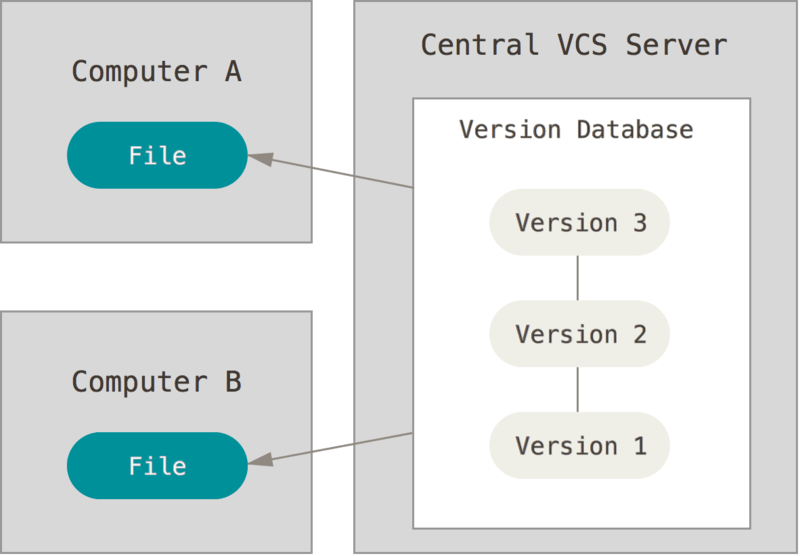
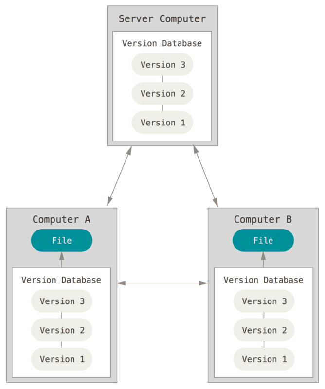
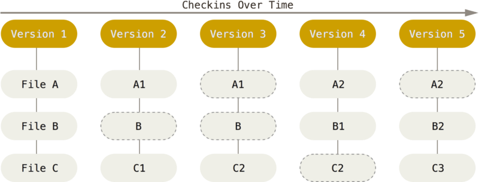
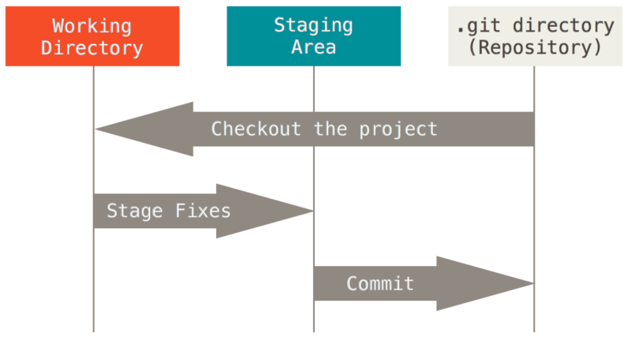

> https://git-scm.com/doc 의 Git Documentation을 참고하여 작성하였다.
# 1. Git Start

## 1.1 Version Control System
> 버전 관리 시스템 : 파일 변화를 시간에 따라 기록 후 특정 시점의 버전을 꺼내오는 시스템

### 1.1.1 Local Version System

Patch Set 라는  특별한 형식의 파일로 저장 (모든 파일을 특정 시점으로 되돌림)


<center>그림 1.1 Local Version System</center>

### 1.1.2 중앙집중식 버전 관리 (CVCS)
클라이언트 : 중앙 서버에서 파일을 받고 사용(Checkout)
but, 서버 다운시 협업 및 백업을 못하고 프로젝트를 모두 잃는 문제


<center>그림 1.2 CVCS</center>

### 1.1.3 분산 버전 관리 시스템 (DVCS)
 Git에서 사용하는 방식으로 파일의 마지막 스냅샷을 Checkout하지 
않고 저장소 자체를 히스토리와 더불어 전부 복제.
리모트 저장소가 존재 하며 위 두가지 장점을 사용가능함.


<center>그림 1.3 DVCS</center>

## 1.2 Git concepts

### 1.2.1 Data Snapshot
  
- Git은 데이터를 파일 시스템 스냅샷의 연속으로 취급, 크기가 작음.(Snapshot Stream) -> VCS와의 주된 차이점

<center>그림 1.4 Save project snapshot in chronological order</center>

### 1.2.2 Local focus command & integrity

- 어떠한 조건(ex.오프라인)에서도 local로 작업 및 백업 가능
- SHA-1 해시를 이용하여 식별 및 파일 저장 -> Git으로만 파일 상태를 알 수 있음.
   (integrity = accuracy + consistency + effectiveness)

### 1.2.3 The three States of Git

- Committed : 데이터가 로컬 데이터베이스에 안전하게 저장됐다는 것

- Modified : 수정한 파일을 아직 로컬 데이터베이스에 커밋하지 않은 것

- Staged : 현재 수정한 파일을 곧 커밋할 것이라고 표시한 상태


<center>그림 1.5 Working tree, Staging Area, Git directory </center>    

#### - three step

- Git Directory : Git이 프로젝트의 메타데이터 및 객체 데이처 베이스 저장 장소 (clone시 Git Directory 생성)

- Staging Area : Git directory에 존재하며 곧 commit할 파일에 대한 정보 저장하는 단순한 파일

- Working tree : 파일 수정 장소

#### - Git work

1. working tree - Edit file

2. Staging Area file stage & Create a snapshot to commit

3. Staging Area file commit -> Save as snapshot in Git directory

## 1.3 Git install & Configuration

### 1.3.1 Git install

#### - Ubuntu debian

    $ sudo apt install git-all
    $ sudo apt install git*

#### - Windows 
> http://git-scm.com/download/win

### 1.3.2 Git Configuration

> git config : 설정 내용 확인 및 변경

#### - User information

```
$ git config --global user.name "USER_NAME"
$ git config --global user.email EMAIL
```
- 한 번 Commit 후 정보 변경 불가능 즉, <U>한 번만 실행</U>
- 만약 다른 이메일 주소 사용시 --global option 빼기

#### - Check setting

    $ git config --list # every settings
    $ git config --KEY # one setting

#### - Help 

    $ git help <verb>
    $ man git-<verb>
    $ git <verb> -h

# 2. Git Basics

## 2.1 Git repository

#### - Create Git repostitory method

1. Local directory to Git repository
2. Git repository Clone 

### 2.1.1 Local directory to Git repository

#### - Linux

    $ cd /home/user/my_project

#### - Windows

    $ cd /C/user/my_prohect

#### - Command 

    $ git init   
    $ git add *.C   
    $ git add LICENSE   
    $ git commit -m '.... version'

- init : .git 이라는 하위 directory 생성 (Skeleton)
- add : 파일 추가

### 2.1.2 Git repository Clone

    $ git clone <url>

## 2.2 Modified & Saved Git repository

- **Traked** file : included in <U>snapshot</U> (Unmodified, Modified, Staged )
- **Untracked** file : not included in <u>snapshot and Staging Area</U>    


<center>그림 2.1 The life cycle of a file </center>    

### 2.2.1 File status

#### - git status

``` bash
$ git status
On branch joonmoHan
Your branch is up to date with 'origin/joonmoHan'.

Changes not staged for commit:
  (use "git add <file>..." to update what will be committed)
  (use "git restore <file>..." to discard changes in working directory)
        modified:   1_week/joonmo/github_study1.md

Untracked files:
  (use "git add <file>..." to include in what will be committed)
        1_week/joonmo/image-1.png
        1_week/joonmo/image-2.png
        1_week/joonmo/image-3.png
        1_week/joonmo/image-4.png
        1_week/joonmo/image-5.png
        1_week/joonmo/image.png

no changes added to commit (use "git add" and/or "git commit -a")

```

- git_study.md file : Modified & not staged for commit
``` bash
 # Modified to Staging area
git add 1_week/joonmo/github_study1.md 
# commit
git commit -m "작업 내용 설명"
```
- image* : Ustracked files
``` bash
# Unstracked to staging area
git add .
```

#### - README

``` bash
$ echo 'joonmo' > README
$ ls
1_week/  README  README.md
```
- README file은 새로 만든 파일 -> Untracked files

### 2.2.2 Track file

#### - Untracked to Staged

``` bash
$ git add 1_week/joonmo/image.png
$ git status
# staged status files
Changes to be committed:
  (use "git restore --staged <file>..." to unstage)
        new file:   1_week/joonmo/image.png

```

### 2.2.3 Modified to Staged

#### - modified to staged

``` bash
$ git add 1_week/joonmo/github_study1.md
warning: in the working copy of '1_week/joonmo/github_study1.md', LF will be replaced by CRLF the next time Git touches it

$ git status

Changes to be committed:
  (use "git restore --staged <file>..." to unstage)
        modified:   1_week/joonmo/github_study1.md
        new file:   1_week/joonmo/image.png
```

#### - modified

``` bash
$ git status

Changes to be committed:
  (use "git restore --staged <file>..." to unstage)
        modified:   1_week/joonmo/github_study1.md
        new file:   1_week/joonmo/image.png

Changes not staged for commit:
  (use "git add <file>..." to update what will be committed)
  (use "git restore <file>..." to discard changes in working directory)
        modified:   1_week/joonmo/github_study1.md
```
staged 이면서 modified 상태임을 알 수 있음.

### 2.2.4 Status briefly

``` bash
$ git status -s
MM 1_week/joonmo/github_study1.md
A  1_week/joonmo/image.png
?? 1_week/joonmo/image-1.png
?? 1_week/joonmo/image-2.png
?? 1_week/joonmo/image-3.png
?? 1_week/joonmo/image-4.png
?? 1_week/joonmo/image-5.png
```
- ?? : Unstracked
- M : Modified
- A : Staging Area
- MM : Staging Area & modified

### 2.2.5 Ignore file

#### - example
``` bash
$ echo 'jjoonmo' > abc.a
$ ls
1_week/  README.md  abc.a
$ git status
# .gitignore file 없는 경우
Untracked files:
  (use "git add <file>..." to include in what will be committed)
        abc.a
# .gitignore file 있는 경우
Untracked files:
  (use "git add <file>..." to include in what will be committed)
        .gitignore
```
#### - .gitignore note
``` bash
# 확장자가 .a인 파일 무시
*.a

# 윗 라인에서 확장자가 .a인 파일은 무시하게 했지만 lib.a는 무시하지 않음
!lib.a

# 현재 디렉토리에 있는 TODO파일은 무시하고 subdir/TODO처럼 하위디렉토리에 있는 파일은 무시하지 않음
/TODO

# build/ 디렉토리에 있는 모든 파일은 무시
build/

# doc/notes.txt 파일은 무시하고 doc/server/arch.txt 파일은 무시하지 않음
doc/*.txt

# doc 디렉토리 아래의 모든 .pdf 파일을 무시
doc/**/*.pdf
```
### 2.2.6 View changes
- Unstaged 상태인 것만 보여줌.
``` bash
# modified
$ git diff
# Stage Area
$ git diff --staged # or --cached

```

### 2.2.7 Commit, rm, mv, log, Undoing tihngs
#### - Commit
- staged -> Commit -> Unmodeified
``` bash
$ git commit -m "변경 내용 작성"
```
#### - rm
``` bash
# file, Git Track delete
$ rm "FILE_NAMR"
# Git Tracke delete
$ git rm "FILE_NAME"
```
#### - mv
``` bash
$ git mv CURRENT_FILE_NAME NEW_FILE_NAME
```
#### - commit
``` bash
# rm & mv -> commit --> save
$ git commit -m "설명 메시지"
```
#### - log
``` bash
# repository's commit history to timeline
$ git log
# diff result
$ git log -p # or --patch
# statistical imformation
$ git log --stat
```

#### -  Undoing things

``` bash
# recommit
$ git commit --amend # modify and add
# to Unstage
$ git reset HEAD FILE_NAME
# Revert modified file
$ git checkout -- FILE_NAME
```

## 2.3 Remote repository

### 2.3.1 Showing Remote
``` bash
$ git remote
origin
$ git remote -v
origin  https://github.com/Rokey-3-team2-study/git_study.git (fetch)
origin  https://github.com/Rokey-3-team2-study/git_study.git (push)
```
### 2.3.2 Addig Remote
``` bash
$ git remote add <NAME> <url> 
```
### 2.3.3 Pull & Fetch & Push
``` bash
# Remote repository data 모두 가져오기
# Metge & Access 가능
$ git fetch <remote>
# project 공유
$ git push origin master
```
- 만약 clone을 하고 fetch시 수정된 모든 것 가져옴. but, 자동 Merge 안됨. -> 수동 Merge
- Clone이 여럿 있을 경우, Push 후 다른 사람 작업을 Merge후 Push 가능
### 2.3.4 show & rename & delete
``` bash
$ git remote show origin
$ git remote rename CURRENT_NAME NEW_NAME
$ git remote remove NAME
```

# 3. Git Branch

## 3.1 Branch concepts

### 3.1.1 Branch 

- 코드의 독립적인 작업 공간 -> test & modify 용이
- 가볍고 빠름 (commit을 가리키는 pointer -> pointer를 하나 추가하는 작업)
- 쉬운 Merge

### 3.1.2 example
``` bash
# branch 생성
$ git branch NAME
# branch 이동 (포인터 이동)
$ git checkout NAME
# branch 병합
$ git merge NAME
# branch 삭제
$ git branch -d NAME
```

## 3.2 Branch Merge

### 3.2.1 Branch Merge method

#### - Fast-forward

- branch가 직접 연결된 상태
- 단순히 branch pointer -> recent commit

#### - 3-way Merge

- branch가 다른 경로로 작업 된 경우
- 공통 branch를 사용해 Merge 후 delete
``` 
master -- A -- B -- C
         \
          D -- E
```

### 3.2.2 Conflict

- Merge하는 두 branch에서 같은 파일 동시 수정시 conflict
``` bash
# confilct message
Auto-merging index.html
CONFLICT (content): Merge conflict in index.html
Automatic merge failed; fix conflicts and then commit the result.
```
- git status -> unmerged file 수동 해결

## 3.3 Remote Branch

### 3.3.1 Remote vs Local

> Remote branch : Remote Repository branch
>                 romote-tracking branch - local pointer

1. remote branch
   - remote repository 존재
   - 협업 시 여러 사용자 공유

2. remote tracking branch
   - local 의 remote branch 추적
   - remote repository 마지막 업데이트 기록
   - 수정 X
  
3. Local branch
   - local 환경
   - Push 하지 않으면 공유 X

### 3.3.2 Remote branch use

#### - Remote branch status
``` bash
# remote rapository all branch
$ git branch -r
  origin/HEAD -> origin/main
  origin/hojun
  origin/joonmoHan
  origin/main
# remote & local branch staus
$ git branch -vv
* joonmoHan 6b1f781 [origin/joonmoHan] docs before branch
  main      b66de51 [origin/main] Update README.md
```

#### - Rmote data fetch
``` bash
$ git fetch origin
remote: Enumerating objects: 39, done.
remote: Counting objects: 100% (39/39), done.
remote: Compressing objects: 100% (28/28), done.
remote: Total 37 (delta 10), reused 22 (delta 4), pack-reused 0 (from 0)
Unpacking objects: 100% (37/37), 6.93 KiB | 56.00 KiB/s, done.
From https://github.com/Rokey-3-team2-study/git_study
 * [new branch]      donghoon   -> origin/donghoon
   b66de51..c3676a6  main       -> origin/main
 * [new branch]      seokhwan   -> origin/seokhwan
 * [new branch]      yeunho     -> origin/yeunho

$ git branch -r
  origin/HEAD -> origin/main
  origin/donghoon
  origin/hojun
  origin/joonmoHan
  origin/main
  origin/seokhwan
  origin/yeunho
```

#### - Remote branch Pull

``` bash
# pull = fetch + merge
$ git pull origin master
```

#### - Remote branch Push & delete

``` bash
git push <remote> <branch>
git push <remote> --delete <branch>
```

#### - branch tracking


``` bash
# 자동으로 local branch가 remote 추적
git checkout --track <remote>/<branch>
# 기존 loacal branch를 remote 연결
git branch --set-upstream-to=<remote>/<branch> <local-branch>
```