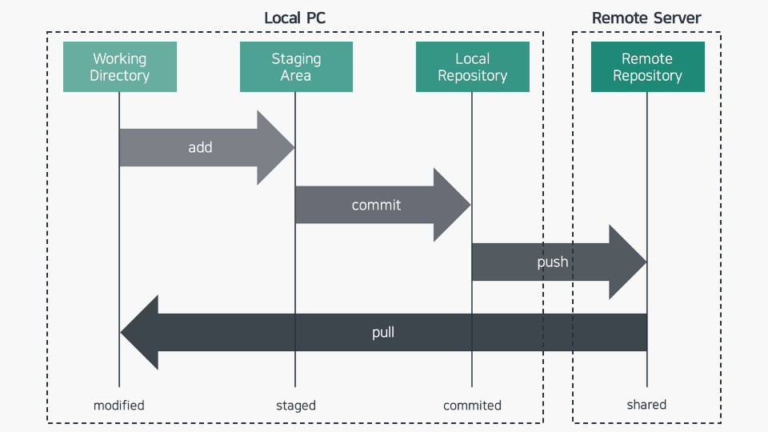
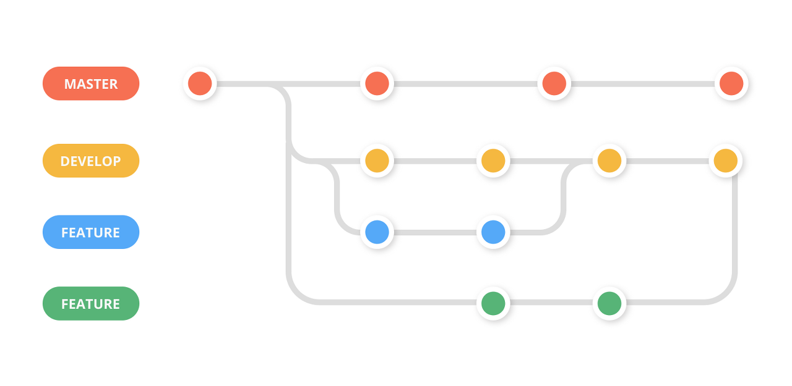

# 깃허브 공부

## 1. 깃허브란?
Git을 기반으로 온라인으로 서비스하는 형태

## 2. 깃허브의 목적
- 협업환경에서 사용
- 누가 언제 무엇을 왜 어떻게 수정했는지 코드 리뷰 가능
- 자신의 Git 을 쉽게 공유 가능
- 대부분의 IDE에서 git 연동 제공   

-> 두명이상의 개발자의 협업을 위해 사용한다

## 3. 구성
   
링크: https://cheris8.github.io/etc/GIT-Basic   

1. Working Direcotry
- 현재 작업중인 깃 프로젝트 파일이 있는 로컬 PC = 내 컴퓨터

2. Staging Area
- **git add** 명령어를 사용하여 변경내용을 저장하는 위치
- Commit 할 변경 내역들의 대기 장소 = 임시 저장

3. Local Repository
- **git commit** 명령어로 변경 내역이 저장되는 위치
- 이전 버전에서 다음 버전의 변경 내역이 담겨 있음
- 여기까지 로컬 PC 내부

4. Remote Repository
- 원격에서 저장되는 저장소 = 온라인 서버
- 커밋 단위로 프로젝트를 다운로드 가능
- 권한에 따라 외부인도 참조 가능
- **git push** 명령어로 서버에 업로드

요약
- 크게 2개
    - 로컬 PC
    - Server = Github
- 작게 4개의 파트로 구별 가능
    - Working Directory, Staging Area, Local Repository, Remote Repository

## 4. 브랜치와 merge
   
링크: https://llshl.tistory.com/31
- 레포지터리는 여러 브랜치로 구성되어 있다
- 각 브랜치에서 작업 후 메인 브랜치에 병합하는 형식으로 사용 가능하다   

**예시**
- Main Branch: 최상위 브랜치
- Develop Branch:
    - Main에서 분기됨
    - 다음 출시 버전을 개발하는 브랜치
- Feature Branch: 
    - Develop 브랜치에서 분기됨
    - 새로운 기능 개발 시 사용
    - 기능 개발 후 Develop Branch에 병합
- Release Branch:
    - 다음 출시 버전을 준비하는 브랜치
    - 버그 수정이나 문서 추가 등 실제 Release전 할 작업 수행

## 5. 사용 명령어
### 초기 설정
- git init: 현재 폴더를 git repository로 만들기
- git config: 로컬 pc의 git 계정 설정
- git clone: 원격 저장소의 내용을 로컬 PC에 저장

### 내용 변경 및 다운로드, 업로드
- git status: git의 상태 확인
- git add: 변경사항을 Staging Area에 저장
- git commit: Staging Area의 내용을 Local Repository에 저장
- git push:Local Repository의 내용을 원격 저장소에 업로드
- git pull:원격 저장소의 내용을 Local Repository에 다운로드

### 브랜치 관리
- git branch
    - git branch: 브랜치 목록 확인
    - git branch "브랜치명": "브랜치명"의 브랜치 생성
    - git branch -d "브랜치명": "브랜치명"의 브랜치 삭제
- git checkout: 현재 작업 중인 브랜치 변경
- git merge "브랜치명": 현재 브랜치에 "브랜치명"의 변경사항을 병합

### 기타
- git stash: 변경사항 임시 저장
- git log: 커밋 기록 확인

